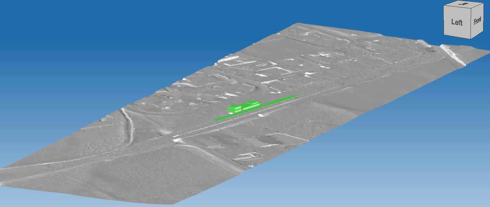

# Building 02 - BC001-BU02

| Test code | Test author     | Test dataset source | Test direction |
|-----------|-----------------|---------------------|----------------|
| BU02      | Stefan Jaud     | SBB                 | Export/Import  |

## Intent

This Test belongs to a series of Tests that share a dataset from the same project as a business case. 
The series of tests that belong to this Business Case are listed as follows:

| Test code | Test name     | 
|-----------|-----------------|
| PS01      | Project setup with georeferencing |
| TE01      | Terrain as existing condition model |
| AL01      | Multiple alignments of railway line |
| LD01      | Loading gauge |
| TR01      | Track panels positioned along alignments |
| BU01      | Building(s) as existing condition model |
| **BU02**  | **Building positioned along alignment** |
| MF01      | Model federation|

## IFC concepts involved in this test

- All listed in [TE01](https://github.com/buildingSMART/IFC4.x-IF/tree/main/tests/TE01#ifc-concepts-involved-in-this-test)
- [Body Geometry](https://ifc43-docs.standards.buildingsmart.org/IFC/RELEASE/IFC4x3/HTML/concepts/Product_Shape/Product_Geometric_Representation/Body_Geometry/content.html)
- [Product Span Positioning](https://ifc43-docs.standards.buildingsmart.org/IFC/RELEASE/IFC4x3/HTML/concepts/Object_Connectivity/Product_Span_Positioning/content.html)
- [Product Relative Positioning](https://ifc43-docs.standards.buildingsmart.org/IFC/RELEASE/IFC4x3/HTML/concepts/Object_Connectivity/Product_Span_Positioning/content.html)
- [Product Linear Placement](https://ifc43-docs.standards.buildingsmart.org/IFC/RELEASE/IFC4x3/HTML/concepts/Product_Shape/Product_Placement/Product_Linear_Placement/content.html)

## Prerequisites

The test plan builds upon the [AL01 test plan](../AL01/Readme.md).

## Test dataset (input)

This test case utilises the dataset collected in the Dataset folder and summarised in the table below. **For more details on each item see [Dataset description](Dataset/README.md).**

| Filename (format)         | Description                                                        |
|---------------------------|--------------------------------------------------------------------|
| BC001_BU02_reference.ifc  | **Reference IFC file**. Contains an exemplary export for this test.|

## Validation criteria

:zap: For this test case to be considered passed, **all criteria listed in this section**, and **the ones of prerequisites tests** shall be verified. :zap:

### Formal rules

#### IFC standard (schema and specification)

When validated using the bSI Validation Service, the IFC must pass:

- Syntax & Schema check
    - https://github.com/buildingSMART/ifc-gherkin-rules/pull/65

#### Test case-specific checks

[IDS file BU02.ids](./Dataset/BU02.ids):

- (RI-80) The `IfcBuilding` instances shall be aggregated in `IfcSite`.

Not covered by the IDS file (must be checked otherwise):

- The `IfcBuilding` instance representing the station shall be relatively positioned to an `IfcReferent`,
 which in turn shall be relatively positioned to the `IfcAlignment`.
- The `IfcBuilding` instance representing the platform shall be span positioned along the `IfcAlignment`.
- The `IfcReferent` instances shall be linearly placed along the `IfcGradientCurve` representation of the `IfcAlignment`.

### Informal criteria

- Both buildings should lie centrally inside the terrain, "parallel" to the elevated track bed.

### Expected geometry

See [above](#informal-criteria).

### Control parameters

The following steps should be performed in order to corroborate that the software is working as expected.

After importing the reference file (`BC001_BU02_reference.ifc`):

- 2D-coordinates of the Platform's corners:
    - `(2689654.194, 1254849.47)`
    - `(2689652.7, 1254841.36)`
    - `(2689497.752, 1254880.85)`
    - `(2689496.46, 1254873.36)`
- Platform's elevation:
    - `459.014` and `459.214`

## Link to requirements

:zap:
